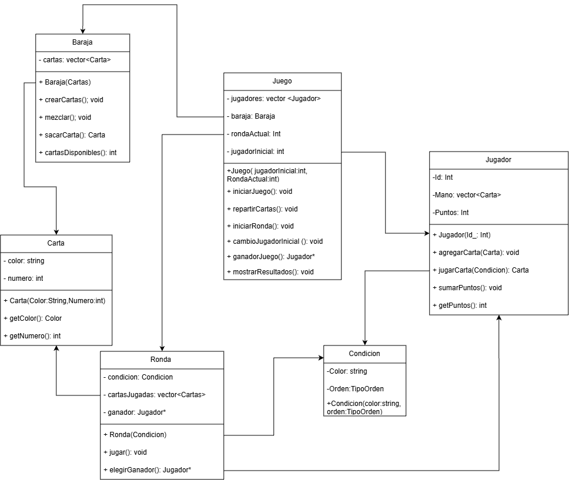
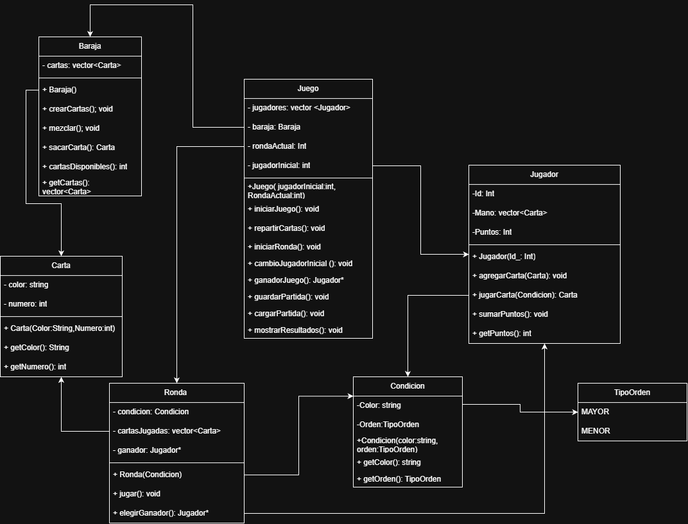

<h3 align="center">Arquitectura y Vista del Proyecto</h3>

  <table>
    <tr>
      <td align="center">
        <b>Juego Estructura (v1)</b> 
        
      </td>
      <td align="center">
        <b>Juego Estructura V2</b> 
        
      </td>
    </tr>
    <tr>
      <td align="center" colspan="2">
        <b>Juego de Cartas</b> 
        
      </td>
    </tr>
  </table>

